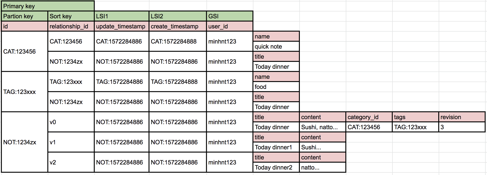

# [Sinote](https://api.sinote.me/v1)
An simple note application is built with Serverless Architecture

## Using AWS services:
- Api Gateway
- Lambda
- DynamoDB
- Cognito


## Other:
- Serverless framework


## How to deploy app:
- Create a AWS Account
- Following this [guide](https://serverless.com/framework/docs/providers/aws/guide/quick-start/) to setup Serverless framework
- Following this [guide](https://serverless.com/framework/docs/providers/aws/guide/credentials/) to setup AWS Credentials
- Delete this code in `serverless.yml` if you don't use custom domain
```
  customDomain:
    domainName: api.sinote.me
    basePath: 'v1'
    stage: ${self:provider.stage}
    certificateName: sinote.me
    createRoute53Record: true
```
- Run  `npm install`
- Run `serverless deploy`
- Now you have a server to save your note


## Design DynamoDB
Most well designed applications require only one table.




## TODO
- [ ] develop client app with Vue
